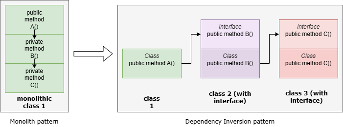
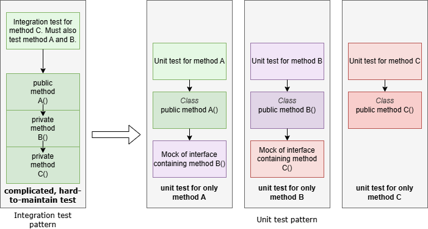

# Testing vision and strategy

## Common

### Vision

Good software should have the following traits:
- It is easy to modify/maintain
- It is easy to test quickly and automatically
- It is easy to use

### Strategy to implement vision

#### Architecture



Instead of writing monolithic classes (as in the above example), we architect classes that are smaller that depend upon abstractions (interfaces) rather than concrete objects.
In C++, an interface is a class composed entirely of pure virtual methods.  An example of an interface in the code is *IFactories*.

Depending upon abstractions instead of concrete objects is known as the Dependency Inversion design pattern.

Examples of classes that follow this pattern (at the time of this writing):
- DaphneVBISinkStageDeps
- DaphneVBIWriterUtil

##### How classes receive their dependencies
Instead of a class calling the constructor of one of its dependencies (and thus having a tightly coupled link),
we *inject* the abstract dependencies (interfaces) into the class constructor.
Formal dependency injection frameworks tend to work better when only interfaces are injected into a constructor,
therefore having a separate *init* method may be wise for non-interface dependencies.

**Important**: The init method should not appear in an interface, only the concrete class.  It's an implementation detail, so only code that handles instantiation (ie factories) should know about it.

**Caveat**: If using this 'init method' convention, you may have to use raw pointers instead of referencing objects (ie ISomeObject* instead of ISomeObject&) due to the compiler not allowing the object to temporarily be null before init is called.

*See DaphneVBISinkStageDeps for example of constructor injection and init method.*

NOTE: We aren't using any dependency injection framework at the moment (we're just manually following this pattern), but we may want to in the future, so I recommend using this 'init method' convention to leave the door open.

##### std::shared_ptr<ISomeInterface> vs using ISomeInterface&
It's more convenient to just pass around references to interfaces (including for testing), so I prefer this by default.
But if there's a question of an interface going out of scope (and thus being de-allocated) prematurely, then I wrap the interface in std::shared_ptr to be safe.

##### What if the class needs to instantiate an object dynamically, such as opening a file?
In this case, I recommend following the pattern shown in the IFactories and IStageFactories interfaces.  Essentially, these are interfaces with methods that return more interfaces.

This is known as the Abstract Factory design pattern.

Any object created by such an interface should be wrapped in std::shared_ptr to ensure it doesn't get de-allocated prematurely.

#### Testing architecture



##### Encapsulation

Get into the mindset of not trying to test your dependencies' internal implementations.  You give your dependencies inputs and expect certain outputs as a result.
It's not your job to test your dependencies' internal implementations or even know what those implementations are.  Trying to do so leads to tight coupling and bad architecture.

Staying intentionally ignorant of how dependencies are implemented internally is known as encapsulation.  Practicing this discipline makes your project easy to modify/maintain.  Any module is free to change its implementation without breaking the rest of the project.
Modules depend upon stable abstract interfaces rather than concrete classes.

##### Unit tests
Unit tests are small, lightweight tests that test only a small bit of code, usually a single method.

Benefits to having a large suite of unit tests:
- They execute extremely quickly (thousands of tests can be run in seconds)
- They are effective at digging into corner cases that would otherwise be difficult (or slow) to automatically test
- They encourage encapsulation in the project architecture, which tends to make the project easier to modify/maintain
- They are self-contained so don't require any 'tribal knowledge' to set up
- If they fail, it's really easy to pinpoint the source of the problem

Rules for unit tests:
- All dependencies are mocked out. They never touch the file system, the network, a database, or the system clock. This makes them deterministic which is very desirable.
- They usually only test a single method.  If a method calls a small private method, this forces your test to test two methods.  This is usually okay if the private method is very simple, but large private methods are an anti-pattern and should be moved to another class/interface.
- My rule of thumb is that unit tests should make up 80% of all tests for a well-designed project.

##### Integration tests
Integration tests test multiple methods, possibly even multiple classes together, to get an overall idea of whether a section of the project works.

They tend to execute slowly, are poor at digging into corner cases, and tend to be bigger (as in lines of code) and harder to maintain.

I tend to use them to test a few 'happy path' cases, just to ensure that everything is wired up correctly.
Unit tests aren't great at 'big picture' stuff, so having a few integration tests, possibly even end-to-end tests, is handy.

Integration tests may test the file system, network, database, clock, etc, so are harder to troubleshoot if anything goes wrong,
and may harder for a newcomer to set up in their environment.

##### Mocks

Mocks are classes that implement interfaces, designed specifically for unit testing.

They return expected results from methods when expected arguments are passed into those methods.
They specifically do NOT try to implement any real functionality.
Methods should be designed to not care how their dependencies are implemented; this is crucial to maintain good encapsulation and keep your project easy to modify/maintain.

For example, a mock of a *multiply* method would return 12 when it receives 3 and 4 as inputs.  It would not actually multiply 3 and 4 and return the result.  Going down the road to implementing real multiplication in a test like this is going down the road to tight coupling.  Discipline yourself to not try to test your dependencies' implementations.

One can make ad-hoc mocks from scratch, but it's a lot more efficient to use a formal framework.

For C++, the one I recommend is Google Test (which includes a mocking framework).

Examples of mocks in the project:
- MockFileWriter
- MockObservationContext
- MockStageFactories
- MockFactories

###### Should I mock a class or an interface?

Technically, the Google Test does support mocking a class instead of an interface.

However, I discourage this practice because when one mocks an interface, it's impossible for side effects to creep through in tests.
If one mocks a class, side effects are possible (ie if one forgets to override a virtual method in the base class).

Sometimes, it's not practical to always avoid mocking a class.
See MockVideoFieldRepresentation as an example where I decided to mock a class (for now).

##### Examples of unit tests

- daphne_vbi_writer_util_test.cpp
- daphne_vbi_sink_stage_deps_test.cpp

## orc-core

### How to run all unit tests

Configure CMake using -DBUILD_UNIT_TESTS=ON, build the project, then run ctest.

```bash
# Configure the project
mkdir build
cd build
cmake .. -DBUILD_UNIT_TESTS=ON

# Build the project
make

# Run all tests
ctest
```

### Test labels and standard invocations

For required stage-level definition-of-done criteria (new stages and stage behavior changes), see [docs/stage-test-expectations.md](docs/stage-test-expectations.md).

CTest labels are used to keep the suite easy to slice during development and in CI.

- `unit`: All GoogleTest-based core unit tests. This is the fast, default label for test-driven iteration.
- `mvp`: The architecture boundary check only (`MVPArchitectureCheck`).
- `sources`: Source-stage unit tests.
- `transforms`: Transform-stage unit tests.
- `sinks`: Sink-stage unit tests, including the existing chroma and Daphne baselines.
- `contracts`: Cross-stage Phase 5 contract tests for registry, node discovery, parameter/default parity, and project-to-DAG wiring.

Standard invocations:

```bash
# All unit tests (fast path during development)
ctest -L unit --output-on-failure

# MVP architecture check only
ctest -L mvp --output-on-failure

# Everything (matches the CI expectation)
ctest --output-on-failure

# Narrow to a specific stage family or contract area
ctest -L unit -L sources --output-on-failure
ctest -L unit -L transforms --output-on-failure
ctest -L unit -L sinks --output-on-failure
ctest -L unit -L contracts --output-on-failure

# Focus on a single stage family test name while keeping the unit label filter
ctest -L unit -R SourceAlign --output-on-failure
```

Label assignment rules:

- Core unit-test executables are registered with `gtest_discover_tests(... PROPERTIES LABELS ...)` in [orc-tests/core/unit/CMakeLists.txt](orc-tests/core/unit/CMakeLists.txt).
- Every unit executable is labeled with `unit` and exactly one family label (`sources`, `transforms`, `sinks`, or `contracts`).
- The top-level `MVPArchitectureCheck` test is labeled `mvp` in [CMakeLists.txt](CMakeLists.txt).

## orc-gui

### Scope

This section defines required coverage, labels, and validation gates for GUI work in `orc/gui/`.

### Build flags

- `BUILD_GUI_TESTS=ON` is required when proposing GUI behavior changes.

### CTest labels

- `gui`: Any test in `orc-tests/gui/unit`.
- `gui-logic`: Tier 1 pure helper logic tests (no `QApplication`).
- `gui-model`: Tier 2 model/coordinator tests (`QCoreApplication`, no display).
- `gui-widget`: Tier 3 offscreen dialog tests (`QT_QPA_PLATFORM=offscreen`).

### Coverage expectations

For any new significant class in `orc/gui/` (beyond trivial structs/forward declarations), add matching tests in `orc-tests/gui/unit/` in the same PR:

- Pure logic helpers: Tier 1 coverage.
- Model/coordinator classes: Tier 2 coverage with presenter-boundary mocks.
- Dialog classes: Tier 3 smoke coverage (construct/show/accept-close) using offscreen backend.
- Parameter-editing dialogs: Tier 3 smoke coverage plus parameter round-trip coverage.

`RenderCoordinator` tests must cover, at minimum:

- Request ordering.
- Response signal delivery.
- Stale response suppression.
- Clean shutdown semantics.

### Test structure expectations

- GUI tests live under `orc-tests/gui/unit/`.
- GUI implementation must be linkable from tests via a non-main GUI library target (for example `orc-gui-lib`), while the executable remains a thin `main.cpp` wrapper.
- GUI unit tests mock presenter interfaces/seams; they do not run a live `orc-core` pipeline.

### Standard invocations

```bash
# Build with GUI tests
cmake -S . -B build -DCMAKE_BUILD_TYPE=Debug -DBUILD_UNIT_TESTS=ON -DBUILD_GUI_TESTS=ON
cmake --build build -j

# Full GUI test suite
QT_QPA_PLATFORM=offscreen ctest --test-dir build -L gui --output-on-failure

# Slice by tier
ctest --test-dir build -L gui-logic --output-on-failure
ctest --test-dir build -L gui-model --output-on-failure
QT_QPA_PLATFORM=offscreen ctest --test-dir build -L gui-widget --output-on-failure
```

### Validation gates (pre-PR)

```bash
cmake --build build -j
QT_QPA_PLATFORM=offscreen ctest --test-dir build -L gui --output-on-failure
ctest --test-dir build -R MVPArchitectureCheck --output-on-failure
```

### PR checklist (orc-gui)

- Tier-appropriate tests added in same PR as GUI behavior changes.
- Offscreen widget tests pass where applicable.
- Presenter-boundary mocking used.
- MVP architecture check passes.
- Any intentional skips documented in test body with rationale.
